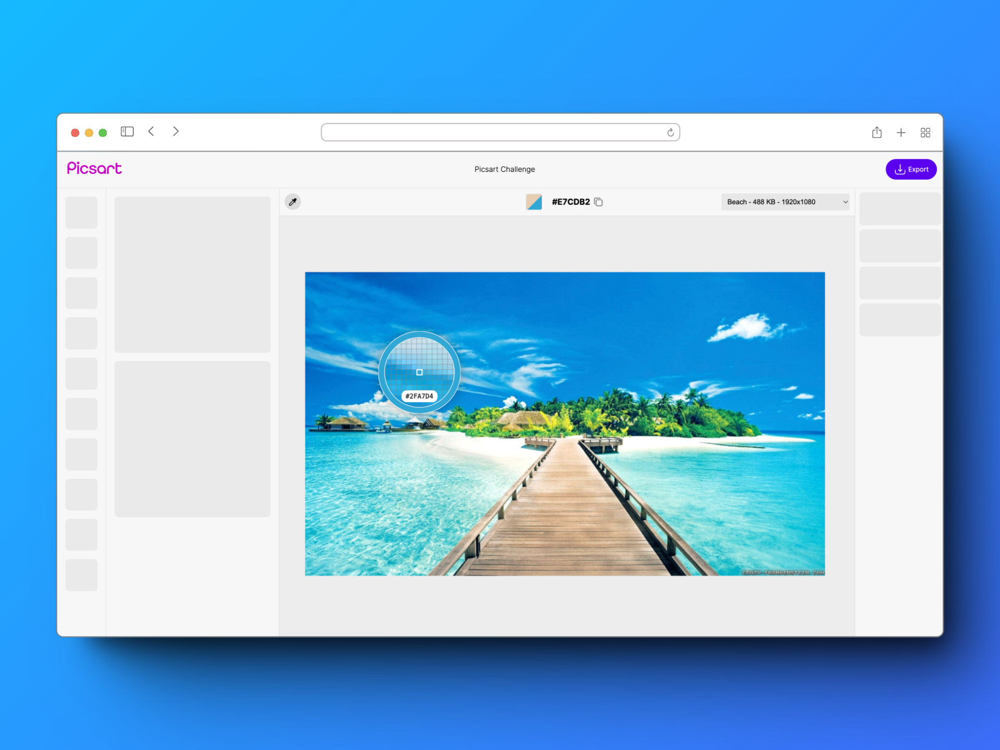
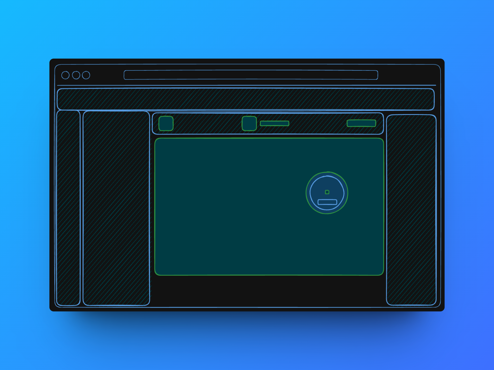
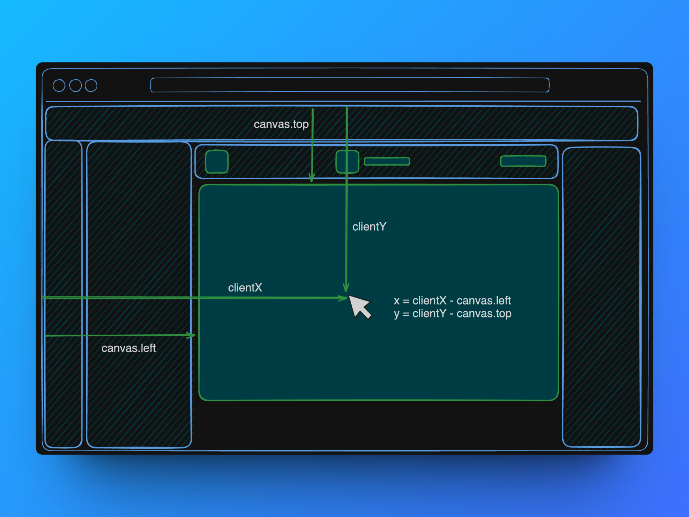
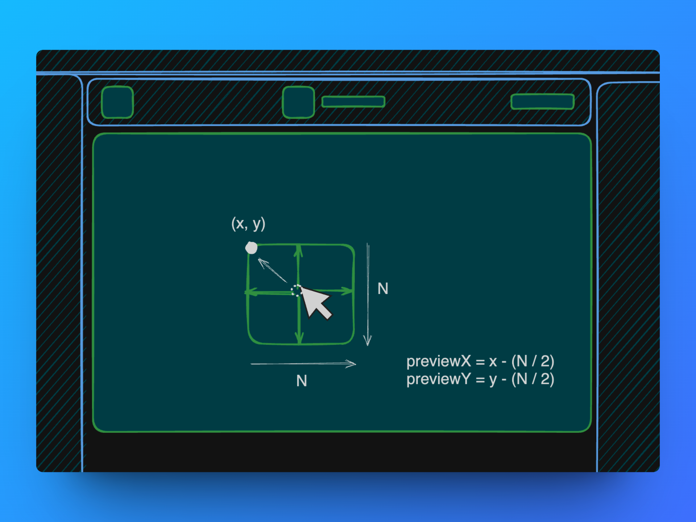
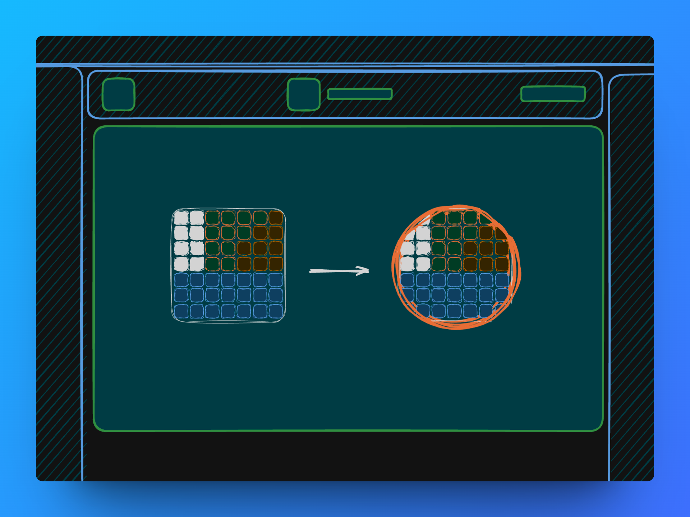
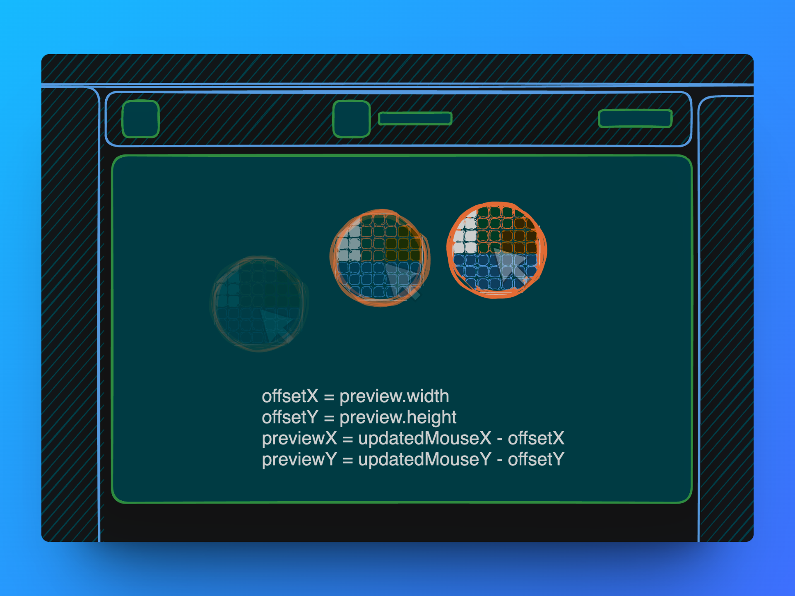

# Picsart Challenge

This is a web application for the Picsart Challenge.

The app was made with React, Typescript and vanilla CSS. It is hosted on vercel so you can check a live demo [here](https://picsart-challenge.vercel.app/).



### Contents
- [Picsart Challenge](#picsart-challenge)
    - [Contents](#contents)
    - [How to run](#how-to-run)
    - [Features](#features)
    - [Aproach](#aproach)
      - [1. Sketching](#1-sketching)
      - [2. Getting the Image Data](#2-getting-the-image-data)
      - [3. Color Picker Preview](#3-color-picker-preview)
      - [4. Follow the Mouse](#4-follow-the-mouse)
    - [Things to Improve](#things-to-improve)

### How to run

1. Clone the repository
2. Install dependencies
   ```sh
   npm install
   ```
3. Run the application
    ```sh
   npm run dev
   ```

### Features
**Technical Requirements**
- [x] **Usage of Canvas**: The HTML canvas tag was used in the main working are and for the preview.
- [x] **Usage of Typescript**: The project was written in Typescript..
- [x] **Being able to work with at least 16 MB(4000 * 4000) canvas**: The projects handdles large images, it is possbile to zoom in and out to fit the images in the canvas. Also, theres is a select option that sets different images to test.

**Extra features**
- **Color comparison**: When hovering over a color, it will show the hovering color next to the last current color so it's easy to compare.
- **Image Selection**: Theres is a dropdown that allows the user to select an image from the list of images.
- **Zoom**: The user can zoom in and out to fit the image in the canvas.
- **Prevision Test**: The app renders a section with small squares that are used to test the color picker pixel accuracy. It is located at top left corner of the canvas.

### Aproach

#### 1. Sketching
Before starting to code, I did some sketching to get a better idea of the requirements and make important decisions, like app layout, canvas position and preview size.



#### 2. Getting the Image Data
In order to get the pixels colors of the image, first, I'm getting the mouse position inside the canvas



Then, I defined the area of the canvas that I want to get the pixels colors, in this case, it's a matrix of NxN pixels.



After getting all pixels data from the hovering area, I parse the Uint8ClampedArray to an array of hexadecimal colors.

#### 3. Color Picker Preview
I tried to used a grid of divs to show the illusion of zooming in the image's pixels, but performance was not good enough, so I decided to use a canvas to draw the pixels instead.

After the Uint8ClampedArray is parsed, I draw the pixels to the canvas and updated them every time the mouse moves.

After that, I clip the element with a circle and add the SVG ring on top of it.

 

#### 4. Follow the Mouse
The only thing left was following the mouse. The preview is moved every time the mouse updates it's positon, it transitionates with a small delay of 20ms that makes it smoother.

 

### Things to Improve
- The image flikers when zooming in and out. It can be solved by rendering a temporary canvas with the last state of the main canvas before sacling it and then draw the new image to the main canvas.